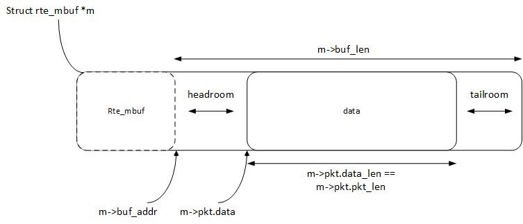
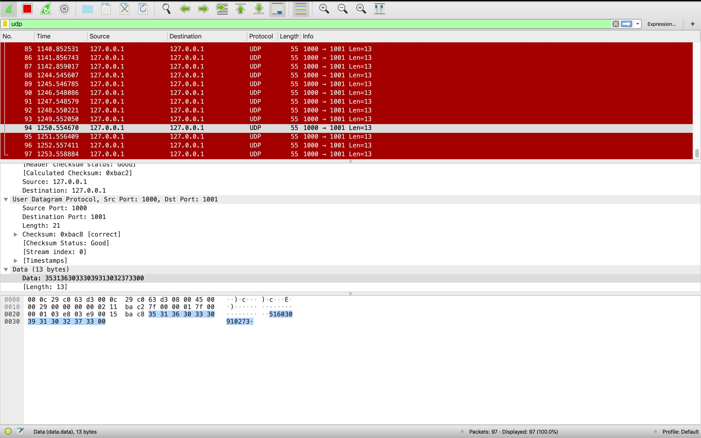

# Part 1: Get familiar with DPDK
## Q1: What’s the purpose of using hugepage?
* TLB entry增加，降低TLB miss， 进而降低访存开销
* 例如在x86架构下，每次TLB miss都会引发3次内存访问，开销巨大
## Q2: Take examples/helloworld as an example, describe the execution flow of DPDK programs?
```
    main() ---------------------------->rte_eal_init()
                                            |
    main() <--------------------------------|
        |     
        | ---------------if ret<0 --->rte_panic()
        |                                   |
    main() <--------------------------------|
        |                   
        | ----------------------------> RTE_LCORE_FOREACH_SLAVE () ---------> rte_eal_remote_launch()
                                                                                        |
                                        RTE_LCORE_FOREACH_SLAVE () <--------------------|
                                            |
    main() <--------------------------------|
        |
        |                   
        | ----------------------------> lcore_hello()
                                            |
                                            |
    main() <--------------------------------| 
                                
```
* 
    1.  主线程运行入口是main函数，调用了rte_eal_init入口函数，启动基础运行环境
    2.  启动多核运行环境，RTE_LCORE_FOREACH_SLAVE (lcore_id) 如名所示，遍历所有EAL指定可以使用的lcore
    3.  通过rte_eal_remote_launch在每个lcore上，启动被指定的线程。
        * int rte_eal_remote_launch(lcore_hello， NULL, lcore_id);参数lcore_id指定的逻辑核是将要执行从线程的核，运行入口函数lcore_hello
    4.  主线程运行函数lcore_hello， 它读取自己的逻辑核编号(lcore_id)，打印出“hello from core#”
## Q3: Read the codes of examples/skeleton, describe DPDK APIs related to sending and receiving packets.
* 基于端口队列的报文接收函数:
    ``` 
    static inline uint16_t rte_eth_rx_burst(uint8_t port_id, uint16_t queue_id,struct rte_mbuf **rx_pkts， const uint16_t nb_pkts);
    ```
    4个参数意义非常直观:端口，队列，报文缓冲区以及收发包数。
* 基于端口队列的报文发送函数:
    ```
    static inline uint16_t rte_eth_tx_burst(uint8_t port_id，uint16_t queue_id,struct rte_mbuf **tx_pkts， uint16_t nb_pkts );
    ```
* create a memory pool to store message buffers:
    ```rte_mempool_create(...)```
## Q4: Describe the data structure of ‘rte_mbuf’.

* some API:
    * rte_pktmbuf_mtod_offset :  points to an offset into the data in the mbuf.
    * static struct rte_mbuf* rte_pktmbuf_alloc	(struct rte_mempool * mp) : Allocate a new mbuf from a mempool.
    * for more in https://doc.dpdk.org/api/rte__mbuf_8h.html#ad4d1c289d8cffc831dfb77c64f52447b	
# Part 2: send packets with DPDK
* enviroment: vmware--ubuntu18.04 && macOS Mojave
* see source code ```basicfwd.c ```
* the massage passed is 516030910273
* screen shot:

* some problems and solutions:
    1. dpdk EAL: Error reading from file descriptor 8: Input/output error
        * 原因：dpdk不支持在虚拟机添加的网卡
        * solution: 
            * 修改一行代码，跳过dpdk pci 检查
            * (in lib/librte_eal/linuxapp/igb_uio/igb_uio.c)
                * change ```pci_intx_mask_supported(dev)``` to ```pci_intx_mask_supported(dev)||true```
            * rebuild
    2. No free hugepages reported in hugepages-2048kB
        * attention ```EAL: No free hugepages reported in hugepages-1048576kB``` doesn't matter
        * 原因是上次运行DPDK程序后，并没有释放大页面内存,我们可以用下面的命令查看
            * sudo cat /proc/meminfo | grep Huge
        *  用./tool/dpdk-setup.sh的脚本删除
            * [20] Setup hugepage mappings for non-NUMA systems
            * [32] Remove hugepage mappings
    3. the udp struct is ```struct udp_hdr``` but not ```struct UDP_hdr```, the lab2 document is wrong
    4. how to open checksum of ipv4 and udp in wireshark(macOS)
        * Perferences->Protocol->IPV4/UDP 
# Note
## 传统linux
* main procedure:
    1.  数据包到达网卡
    2.  网卡进行DMA
    3.  网卡发送中断，唤醒处理器
    4.  驱动软件填充读写缓冲区
    5.  数据报文->内核协议栈，高层处理
    6.  如果应用在用户态，数据copy
    7.  内核台，继续进行
* bottleneck:
    1. too many interrupt
        * 网络接口 1k mbp->10k mbp
    2. data copy && sys call
        * tcpip由linux kernel 处理
        * copy packet from kernel to user

* opitimization:
    1. NAPI机制
        * 每次系统被中断唤醒，尽量轮询处理多个包
        * 减少context switch
    2. NetMap
        * 共享数据包池
        * 减少data copy

* root problem: linux -- 分时操作系统
    * more cores now
    * context switch and cache replace caused by it still cost high

## DPDK
* (IA)多核处理器高性能包处理
* tech:
    1. 轮询
    2. 用户态驱动
    3. 亲和性 && 独占
    4. 降低访存开销（针对cache，如huge page）
    * ...
* 为上层应用的开发提供一个高性能的基础I/O包